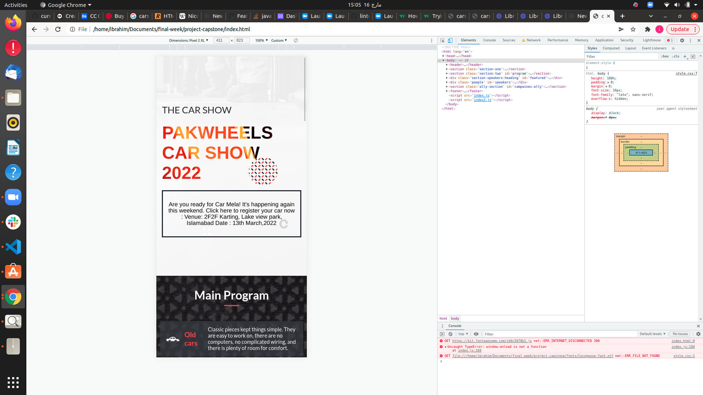

# Capstone Project

> This project contains the HTML, CSS and JavaScript Capstone Project. 

# Project Name
## THE PAKWHEEL show 2022

**   PakWheels has been hosting auto shows in Karachi since 2015. Every year, we arrange this exciting event and call out all car lovers. An auto show, also known as a motor show or car show, is a public exhibition of current automobile models, debuts, concept cars, or out-of-production classics. It is attended by automotive industry representatives, dealers, auto journalists and car enthusiasts. Most auto shows occur once or twice a year** 
# WORK FLOW SCREEN 
## DESKTOP VIEW

## MOBILE VIEW

## Video Presentation
[Click Here to view presentation video](https://www.loom.com/share/7d2164812b454565bd1fe06c0e7b7df6)
## Live Demo
 live view  here https://ibrahim777764.github.io/project-capstone/

## Built With
### Major languages
- HTML
- CSS
- Javascript

### Technologies used
- Github
- Git
- Visual Studio Code

## Acknowledgments

[Cindy Shin](https://www.behance.net/gallery/29845175/CC-Global-Summit-2015) whose design template was used is used for this project.

## Getting Started

To get a local copy up and running follow these simple example steps.

- copy this link `https://github.com/ibrahim777764/project-capstone.git`.
- get the directory that you want to clone the repository.
- open the command prompt in this directory.
- write `git clone https://github.com/ibrahim777764/project-capstone.git`.
- go to the repository folder in your command prompt `cd project-capstone`

## Author
👤 Muhammad Ibrahim Naseer

- GitHub: [@ibrahim777764] (https://github.com/ibrahim777764)
- Twitter: [@Ibrahim66650696 ](https://twitter.com/Ibrahim66650696) 
- LinkedIn: [@ibrahim-naseer-215667225](hhttps://www.linkedin.com/in/ibrahim-naseer-215667225/)

## 🤝 Contributing
Contributions, issues, and feature requests are welcome!

Feel free to check the issues page.

## Show your support
Give a ⭐️ if you like this project!

📝 License
This project is MIT licensed.
