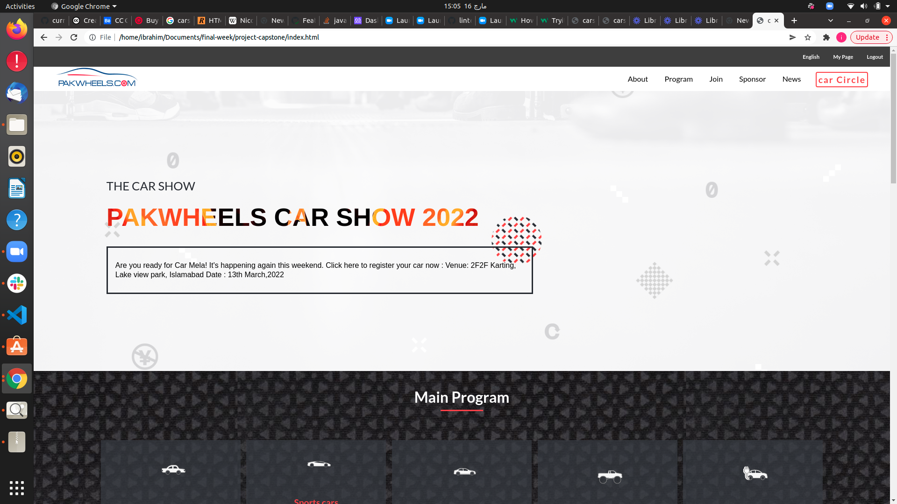

# Capstone Project

> This project contains the HTML, CSS and JavaScript Capstone Project. 

# Project Name
## THE PAKWHEEL show 2022

**   PakWheels has been hosting auto shows in Karachi since 2015. Every year, we arrange this exciting event and call out all car lovers. An auto show, also known as a motor show or car show, is a public exhibition of current automobile models, debuts, concept cars, or out-of-production classics. It is attended by automotive industry representatives, dealers, auto journalists and car enthusiasts. Most auto shows occur once or twice a year** 
# WORK FLOW SCREEN 
## DESKTOP VIEW

## MOBILE VIEW

## Video Presentation
[Click Here to view presentation video](https://www.loom.com/share/7d2164812b454565bd1fe06c0e7b7df6)
## Live Demo
[Click Here to view live version](https://kaylemba.github.io/First-capstone/)
## Built With
### Major languages
- HTML
- CSS
- Javascript

### Technologies used
- Github
- Git
- Visual Studio Code

## Getting Started
*Instructions on how to access my project locally.**
 To Access my project locally please follow the following instructions;
1. Enter this url: https://kaylemba.github.io/First-capstone/ in your web browser.
2. Once opened navigate to the top left level of the project a green code download button will be visible on the righthand side.
3. Select download Zip option from drop down menu.
4. Once the download is complete you will be able to access my project locally.
Here is my repository link: https://kaylemba.github.io/First-capstone/

## Author
👤 Kalolo Chola Lemba

- GitHub: [@KayLemba ](https://github.com/KayLemba)
- Twitter: [@King-Kaylo1 ](https://twitter.com/King_Kaylo1) 
- LinkedIn: [@kalolo-lemba](https://www.linkedin.com/in/https://www.linkedin.com/in/kalolo-lemba-41a8339a/-41a8339a/)

## 🤝 Contributing
Contributions, issues, and feature requests are welcome!

Feel free to check the issues page.

## Acknowledgments

[Cindy Shin](https://www.behance.net/gallery/29845175/CC-Global-Summit-2015) whose design template was used is used for this project.

## Show your support
Give a ⭐️ if you like this project!

📝 License
This project is MIT licensed.
